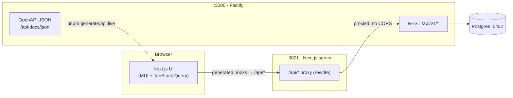

# Web App Template

A full-stack monorepo template for shipping MVPs fast:

- **`backend/`** — [Fastify](https://fastify.dev) API (TypeScript, Postgres, modules of route → service → repository). Exposes an **OpenAPI** spec.
- **`frontend/`** — [Next.js](https://nextjs.org) App Router app (MUI, TanStack Query, Zustand) that consumes the backend through a **typed client generated from that OpenAPI spec**.

The two are wired so the frontend's API layer is always in sync with the backend's contract — change a route, regenerate, and the types (and TanStack Query hooks) update.



## Repository layout

```
web-app-template/
├── backend/            # Fastify API (see backend/README.md, backend/AGENTS.md)
├── frontend/           # Next.js app (see frontend/README.md)
├── docker-compose.yml  # Full stack: Postgres + backend + frontend
├── pnpm-workspace.yaml # pnpm workspace (backend + frontend)
└── package.json        # Root scripts (dev, build, generate:api, up/down)
```

## Prerequisites

- **Node.js ≥ 24** (`nvm use` reads `.nvmrc`)
- **pnpm ≥ 10** (`corepack enable`)
- **Docker** (for Postgres, and for the full-stack compose)

## Quick start (local development)

```bash
# 1. Install all workspace dependencies
pnpm install

# 2. Backend: create its env file and start Postgres
cd backend
pnpm create:env                 # copies .env.example → .env
docker compose up -d postgres   # Postgres on :5432
pnpm db:migrate                 # run migrations
cd ..

# 3. Run backend (:3000) and frontend (:3001) together
pnpm dev
```

Open **http://localhost:3001** — the home page links to a **Users** demo that lists/creates/deletes
users end-to-end through the generated client. Backend API docs (Swagger UI) are at
**http://localhost:3000/api-docs**.

> Run the apps individually with `pnpm dev:backend` / `pnpm dev:frontend`.

## How the frontend talks to the backend

1. The backend describes every REST route with TypeBox schemas and serves an OpenAPI document at
   `http://localhost:3000/api-docs/json`.
2. **Orval** turns that document into typed [TanStack Query](https://tanstack.com/query) hooks in
   `frontend/src/lib/api/`. Regenerate any time with:

   ```bash
   pnpm generate:api        # from the committed frontend/openapi.json (offline)
   pnpm generate:api:live   # pull a fresh spec from the running backend, then generate
   ```

3. In the browser the client calls **relative** `/api/*` URLs. The Next.js server **proxies** those to
   the backend (`BACKEND_URL`, see `frontend/next.config.ts`), so there's **no CORS** in the common case.
   To call the backend directly instead, set `NEXT_PUBLIC_API_URL`; the backend's CORS allow-list is the
   `CORS_ORIGIN` env var (defaults to `http://localhost:3001` in development).

The generated client is committed so the frontend builds out of the box; regenerate it whenever the
backend contract changes.

## Running the full stack with Docker

```bash
pnpm docker:up   # docker compose up --build  → Postgres + migrations + backend + frontend
# Frontend:  http://localhost:3001
# Backend:   http://localhost:3000

pnpm docker:down # stop everything
```

Both apps ship with production **Dockerfiles** (`backend/Dockerfile`, `frontend/Dockerfile`, the latter
using Next.js `standalone` output).

## Ports

| Service   | URL                              |
| --------- | -------------------------------- |
| Frontend  | http://localhost:3001            |
| Backend   | http://localhost:3000            |
| Swagger   | http://localhost:3000/api-docs   |
| OpenAPI   | http://localhost:3000/api-docs/json |
| Postgres  | localhost:5432                   |

## Root scripts

| Script                   | Description                                        |
| ------------------------ | ------------------------------------------------- |
| `pnpm dev`               | Run backend + frontend together                   |
| `pnpm dev:backend`       | Backend only (:3000)                              |
| `pnpm dev:frontend`      | Frontend only (:3001)                             |
| `pnpm build`             | Production build of the frontend                  |
| `pnpm check`             | Lint + typecheck across both packages             |
| `pnpm test`              | Run unit tests across both packages               |
| `pnpm generate:api`      | Regenerate the frontend API client                |
| `pnpm generate:api:live` | Regenerate from the running backend               |
| `pnpm docker:up` / `pnpm docker:down` | Start / stop the full Docker stack   |

## CI

`.github/workflows/ci.yml` runs on every push/PR: the **frontend** job lints, typechecks, tests, and
builds; the **backend** job lints, typechecks, then runs unit and integration tests against a
throwaway Postgres service container.

## Learn more

- Backend architecture & conventions: [`backend/AGENTS.md`](backend/AGENTS.md)
- Frontend details: [`frontend/README.md`](frontend/README.md)
